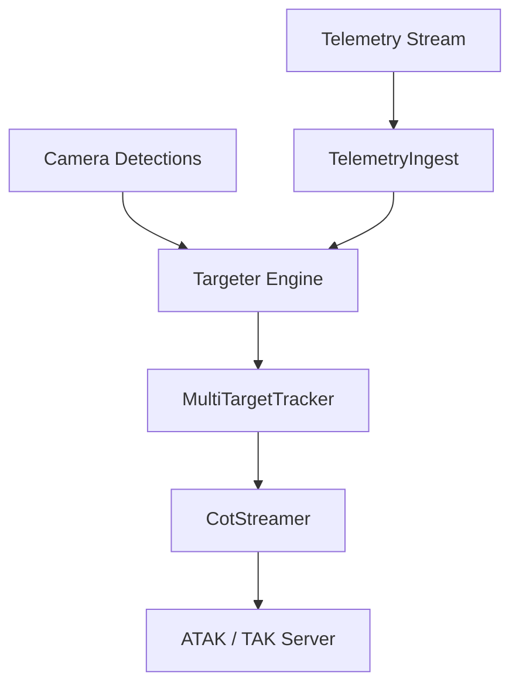

# Airborne CoT Relay

Zero-allocation airborne sensor-to-TAK Cursor-on-Target relay pipeline.

## System Architecture

```mermaid
graph TD
    A[Telemetry Stream] --> B[TelemetryIngest]
    C[Camera Detections] --> D[Targeter Engine]
    B --> D
    D --> E[MultiTargetTracker]
    E --> F[CotStreamer]
    F --> G[ATAK / TAK Server]
```
